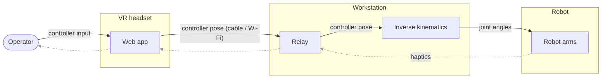

# vr-teleop-kit

A kit for teleoperating robot manipulators with a WebXR headset
(Meta Quest). A web page served from your workstation runs in the Quest
browser, streams 6-DoF controller poses over a WebSocket, and a Python
teleoperator turns them into joint commands via differential inverse
kinematics (forward kinematics and Jacobians read from a MuJoCo model
of the arm). Plugs into [LeRobot](https://github.com/huggingface/lerobot)
as a drop-in `Teleoperator`.

> **Full write-up:** [**VR Teleoperation Stack for Robot Manipulation**](https://aurelarnold.xyz/blog/vr-teleoperation-stack/) walks through the whole stack: the inverse kinematics, the safety features, and the camera and haptic feedback that close the loop.

The robot currently supported end-to-end is a bimanual pair of
[I2RT YAM](https://i2rt.com) arms (with the linear_4310 gripper),
driven through [i2rt](https://github.com/i2rt-robotics/i2rt). The pose
mapping and the relay are robot-agnostic; supporting another arm means
porting the IK layer (see "Adapting to a different arm" below).

Highlights:

- **Clutch-relative mapping**: hold the grip button and the robot follows
  your hand's relative motion; release, reposition, grab again.
- **Controller buttons**: grip = clutch, trigger = gripper, a precision
  modifier (hold to lower the gains for fine work), a button that sends
  the arm back to its home pose, and episode start/save while recording —
  see the [controller reference](#quest-controller-reference).
- **Dataset recording**: `examples/record_bi_yam.py` writes LeRobot v3.0
  datasets (parquet + mp4) straight from VR, one or both arms, with an
  optional push to the Hugging Face Hub.
- **Reach limit**: the target pose can never run more than a fixed
  distance or angle ahead of the robot. Pressing past a joint limit or the
  workspace boundary feels like a wall (with haptic feedback), and
  reversing bites immediately, like a mouse cursor at the edge of the
  screen.
- **Decoupled IK**: joints 1-3 track position, the
  wrist tracks orientation, both as damped-least-squares steps with
  manipulability-adaptive damping (graceful near singularities and
  gimbal lock).
- **Wrist-pivot calibration**: a 5-second in-VR ritual aligns the
  controller read-out point with your anatomical wrist pivot, so pure
  wrist twists don't drag the arm around.
- **Haptics**: gripper grasp force and IK trouble (joint limits, reach,
  gimbal proximity) are mapped to controller vibration.
- **Camera streaming**: optional WebRTC streams of robot cameras,
  rendered as world-locked panels inside VR.
- **Two ways to connect**: USB cable (`adb reverse`, ~1 ms latency,
  recommended) or Wi-Fi (LAN HTTPS with a self-signed certificate). A
  public tunnel works for pose streaming too, but the WebRTC camera media
  is not configured off-LAN (it needs a TURN server), so full remote
  operation isn't set up.
- Live-tunable settings (gains, smoothing, velocity caps, haptic
  thresholds) from the web page, applied on the next solver tick.

## Architecture

Three layers, separated by how robot-specific they are:

```
src/vr_teleop_kit/
├── core/      robot-agnostic: clutch-relative pose mapping + reach limit
├── relay/     robot-agnostic: FastAPI WebSocket relay, WebRTC cameras,
│              and the WebXR page served to the Quest
├── ik/        YAM-tuned: decoupled IK (MuJoCo model built from the i2rt
│              yam.xml + gripper MJCF, wrist-anchor geometry, mount frames)
└── lerobot/   thin adapter: LeRobot Teleoperator classes wiring core+ik
               into the LeRobot action interface
```



For pose and state messages the relay is a pure broadcast hub: any number
of clients (teleop processes, MuJoCo viewers) can subscribe to the same
stream. (It also publishes the optional WebRTC camera tracks.)

## Install

```bash
git clone https://github.com/Dream-Machines-Robotics/vr-teleop-kit
cd vr-teleop-kit
pip install -e ".[relay,lerobot]"           # or: uv pip install -e ".[relay,lerobot]"

# YAM model files (and, for real hardware, the driver):
git clone https://github.com/i2rt-robotics/i2rt
pip install -e ./i2rt        # only needed to drive real hardware

# The IK finds the model files in the ./i2rt clone automatically. If the
# clone lives elsewhere, point at the arm MJCF instead (or pass
# model_path in the teleop config):
export YAM_XML=/path/to/i2rt/i2rt/robot_models/arm/yam/yam.xml
```

The `relay` extra covers the server (FastAPI, aiortc, OpenCV); the
`lerobot` extra covers the Teleoperator adapter. The bare package (pose
mapping + IK) only needs numpy, mujoco and websockets.

## Run the relay and connect the headset

Both transports serve the same page on port 8443; they differ only in
how the Quest reaches it. WebXR requires a secure context, which is why
the two paths exist.

**USB (recommended)**: plain HTTP on localhost (a secure context per the
WebXR spec), forwarded over the cable:

```bash
vr-teleop-relay                               # binds 127.0.0.1:8443
adb reverse tcp:8443 tcp:8443                 # forward Quest's localhost over USB
# Quest browser → http://localhost:8443/
```

One-time Quest setup: enable Developer Mode (Meta Quest mobile app →
Devices → your headset → Developer Mode), plug in the cable, accept the
"Allow USB debugging" prompt in the headset. `adb reverse` must be re-run
after re-plugging the cable.

**LAN**: HTTPS with a self-signed certificate; the Quest shows a
"not secure" warning the first time, which you accept:

```bash
mkdir -p certs
openssl req -x509 -newkey rsa:4096 -nodes -days 825 \
    -keyout certs/key.pem -out certs/cert.pem \
    -subj "/CN=$(hostname)" \
    -addext "subjectAltName=DNS:$(hostname),DNS:localhost,IP:127.0.0.1,IP:<your-lan-ip>"
vr-teleop-relay --host 0.0.0.0 --ssl-keyfile certs/key.pem --ssl-certfile certs/cert.pem
# Quest browser → https://<your-lan-ip>:8443/
```

`certs/` is gitignored; never commit key material. USB has ~1 ms RTT and
no jitter; LAN works but Wi-Fi adds occasional >100 ms spikes. A public
tunnel (e.g. `cloudflared tunnel --url http://localhost:8443`) also works
for pose streaming, but WebRTC camera media is peer-to-peer and needs a
TURN server off-LAN (not configured here).

On the page: **Calibrate wrist** once per operator (squeeze both grips
in VR, then for 5 s twist your hands while keeping each wrist roughly in
place: the hand rotates, the wrist pivot stays still), then
**Start Teleop**. Settings (gains, smoothing, velocity caps, haptics)
are on the same page and apply live.

## Quest controller reference

Everything is driven from the controllers; no keyboard is needed during a
session. The first four bindings are per-arm — the left controller drives
the left arm, the right the right.

| Control | Action | What it does |
| --- | --- | --- |
| **Grip** (squeeze) | hold | Clutch. That arm follows your hand's *relative* motion. Release to freeze the arm and reposition your hand, squeeze again to re-anchor. |
| **Trigger** | analog | Gripper closure, `0.0` open → `1.0` closed. Only tracked while grip is held, so the gripper won't drift between corrections. |
| **A** (right) / **X** (left) | hold | Precision scale. Multiplies that arm's translation *and* rotation gains by `precision_factor` (default `0.5`) for fine positioning. Re-anchors on press and release, so there's no snap. |
| **Thumbstick click** | press | Send that arm to its home/rest pose, ramped over ~2 s. Handy between episodes. |
| **B** (right) | press | **Recording only**: start an episode when idle; discard the take and restart it immediately when already recording. |
| **Y** (left) | press | **Recording only**: save the episode in progress. |

Outside the recorder, **B** and **Y** are generic handoff signals
(`is_pause_pressed` / `is_reverse_pressed`) for an orchestrator to poll —
see "Use as a LeRobot Teleoperator" below.

Note the asymmetry when recording single-arm: start/save live on
*different* controllers, so you need both in hand even for a `--arm right`
session.

## Cameras

The relay auto-discovers RealSense color streams at startup — no
`source cams.env` needed. Discovery globs `/dev/v4l/by-id` for the color
node (index 4 on the D405) and matches each camera's serial to a role
(`top` / `left` / `right`) via the map in
`src/vr_teleop_kit/relay/cameras.py`. Update that map when you swap a
camera, or point `CAM_MAP` at a JSON file (`{"<serial>": "<role>"}`) to
override without editing code.

```bash
python tools/gen_cams_env.py          # print what's detected (no writes)
python tools/gen_cams_env.py --write  # (re)generate ./cams.env to source elsewhere
```

`cams.env` is now a generated, gitignored artifact — handy for a shell
that needs the `CAM_*` vars (e.g. the recorder). An explicit `CAM_TOP` /
`CAM_LEFT` / `CAM_RIGHT` still overrides discovery for that role;
`CAM_*_ROTATE` (0/90/180/270) and `CAM_COLOR_INDEX` tune capture.

## Try it without a robot

```bash
vr-teleop-relay                       # terminal 1
python tools/viewer_client.py         # terminal 2: MuJoCo viewer (YAM model)
python examples/pure_sim.py           # terminal 3: IK loop, no hardware
# Quest browser → Start Teleop → squeeze a grip
```

`tools/smoke_test.py` drives the full pipeline with a fake Quest client
and asserts on the resulting actions (no headset needed).

(`pure_sim.py` and `smoke_test.py` use the LeRobot Teleoperator adapter,
so they need the `[lerobot]` extra — installed by the Install command
above, not just the bare package.)

`tools/viewer_client.py` renders one arm per window (`--arm left|right`);
`tools/viewer_both.py` puts both arms in a single scene, which is easier
to watch during a bimanual session.

## Drive the arms

Two terminals: the relay, then the teleop loop.

```bash
vr-teleop-relay                          # terminal 1
adb reverse tcp:8443 tcp:8443            # USB only

python examples/teleop_bi_yam.py         # terminal 2 — both arms
python examples/teleop_bi_yam.py --arm right     # right arm only
```

| Argument | Default | Notes |
| --- | --- | --- |
| `--arm both\|left\|right` | `both` | Single-arm still tracks both controllers; only the chosen arm is connected and driven. |
| `--right-can` | `can0` | Right arm's CAN interface. |
| `--left-can` | `can1` | Left arm's CAN interface. |
| `--freq` | `200` | Control loop rate (Hz). |
| `--rest-duration-s` / `--rest-steps` | `3.0` / `90` | Startup ramp to the rest pose. |
| `--ws-url` | `ws://127.0.0.1:8443/ws` | Use `wss://` if the relay serves TLS. |

The arms ramp to their rest pose on startup and again on exit. Rest pose
defaults to all-zero joints; override per arm with seven comma-separated
values (joints 1–6 + gripper — the gripper value is dropped, since the
trigger drives it):

```bash
export RIGHT_REST_POSE="0,0.3,-0.5,0,0.2,0,1"
export LEFT_REST_POSE="0,0.3,-0.5,0,0.2,0,1"
```

IK gains are also exposed as flags (`--scale-translation`,
`--scale-rotation`, `--pose-filter-alpha`, damping/reach limits) for a
permanent default; the web Settings panel tunes the same values live.

## Record a dataset

`examples/record_bi_yam.py` writes a LeRobot v3.0 dataset — `data/` as
parquet, each camera as an mp4 — driven entirely from the controllers.
Needs the `[lerobot]` extra.

```bash
vr-teleop-relay                          # terminal 1
adb reverse tcp:8443 tcp:8443            # USB only

# terminal 2 — bimanual, all 3 cameras, 20 episodes, upload when done
python examples/record_bi_yam.py \
    --repo-id <hf-user>/yam-towel-fold \
    --task "use one arm to anchor the towel and fold it with the other" \
    --num-episodes 20 --push-to-hub
```

Right arm only, which also drops the left wrist camera:

```bash
python examples/record_bi_yam.py --arm right \
    --repo-id <hf-user>/yam-pick-cube --task "pick up the cube" \
    --num-episodes 20 --push-to-hub
```

Rehearse the whole flow with no motors and no hardware:

```bash
python examples/record_bi_yam.py --sim --repo-id local/rehearsal --overwrite
```

Then, in VR: **right B** to start, do the task, **left Y** to save.
Repeat. The session ends itself after `--num-episodes` saves.

| Argument | Default | Notes |
| --- | --- | --- |
| `--arm both\|left\|right` | `both` | Selects arms **and** cameras: `both` → 14-dim `left_*`/`right_*` + all 3 cameras; `right` → 7-dim `right_*` + top and right-wrist only. |
| `--num-episodes` | `0` | End the session after this many *saved* episodes. `0` = run until Ctrl-C. |
| `--repo-id` | `atharva/yam-teleop-<stamp>` | Dataset id. **Set this** — the owner must match your `hf auth login` account or `--push-to-hub` fails with 403. |
| `--task` | `"teleop"` | Language instruction stored on every frame. Set it; relabelling afterwards means rewriting the dataset. |
| `--push-to-hub` | off | Upload when the session ends, after the arms power down. **Public** unless `--private`. |
| `--private` | off | Make the pushed repo private. |
| `--fps` | `30` | Dataset and control-loop rate. |
| `--no-cameras` | off | Record state/action only. |
| `--sim` | off | i2rt MuJoCo sim robots — rehearse with no hardware. |
| `--overwrite` | off | Delete an existing dataset dir instead of erroring. |
| `--root` | LeRobot's | Local dataset root. |
| `--left-can` / `--right-can` | `can1` / `can0` | Per-arm CAN interface. |

Which cameras get recorded is decided by discovery (see "Cameras" above)
intersected with `--arm`: the `top` camera is always kept, and a wrist
camera only when its arm is in use. Pin devices explicitly with
`CAM_TOP` / `CAM_LEFT` / `CAM_RIGHT` if discovery picks wrong.

Two things that will cost you data:

- **Don't enable the Quest camera stream while recording.** A v4l2 device
  opens once; the relay would grab the same RealSense and the recorder's
  `open()` fails with "cannot open camera".
- **Ctrl-C during an open episode discards it.** Press **left Y** to save
  first. The first Ctrl-C parks the arms and holds them there; a second
  powers them off.

The dataset is finalized on disk before the arms are parked, so it's
complete and loadable even if you interrupt the shutdown. A failed
`--push-to-hub` is logged and the local copy kept for a manual retry.

## Use as a LeRobot Teleoperator

The adapter emits a bimanual joint action dict
(`{left,right}_joint_{1..6}.pos`, `{left,right}_gripper.pos`; gripper
0 = open, 1 = closed), so it pairs with any follower using that schema.
Nothing is copied into LeRobot's tree; you instantiate and hand it to
your loop:

```python
import time

from vr_teleop_kit.lerobot import BiQuestTeleoperator, BiQuestTeleoperatorConfig

teleop = BiQuestTeleoperator(BiQuestTeleoperatorConfig(
    id="vr-teleop",
    ws_url="ws://127.0.0.1:8443/ws",
    model_path="/path/to/i2rt/.../arm/yam/yam.xml",  # or set YAM_XML / rely on ./i2rt
))

teleop.connect(); follower.connect()
while True:
    follower.send_action(teleop.get_action())
    time.sleep(1 / 200)
```

`examples/teleop_bi_yam.py` (see "Drive the arms" above) is the complete
hardware version of this loop: it drives two i2rt YAMs (one CAN channel
per arm) directly via
`get_yam_robot`, with the rest ramp, gripper-convention conversion
(i2rt's normalized gripper is 0 = closed, 1 = open — the inverse of the
teleop's), haptic feedback, and timing. For LeRobot CLIs, import
`vr_teleop_kit.lerobot` so the `@register_subclass` decorators run, then
use `--teleop.type=bi_quest_teleop` (bimanual) or
`single_arm_quest_teleop` (one arm, unprefixed action keys).

For human-in-the-loop data collection: the teleop exposes intervention
hooks (`is_engaged`, `is_handoff_pressed`, `is_pause_pressed`,
`is_reverse_pressed`, `seed_qpos_from_obs`, `publish_state`) that an
orchestrator can poll to hand control between a policy and the operator.
We use these for an HG-DAgger workflow built on top of this stack in our
LeRobot fork; that workflow is not part of this repository.

## Enabling grasp-force haptics

The grasp-force haptic (the controller buzzing as the gripper closes on an
object) reads the gripper torque through an optional follower method,
`get_joint_torques()`, returning
`{"{left_,right_}gripper.torque": Nm, "{left_,right_}gripper.pos": 0..1}`.
This step is optional: the teleop feature-detects the method via `getattr`
and degrades gracefully without it, disabling only the grasp-force
vibration (the IK-trouble haptics still fire).

On YAM this works out of the box: i2rt reports the gripper motor effort
in `get_observations()` (`gripper_eff`), and `examples/teleop_bi_yam.py`
forwards it (plus the gripper position for velocity masking) to
`teleop.send_feedback({"torques": ...})` every tick. If you write your
own follower, implement `get_joint_torques()` with the contract above —
any driver that does gets grasp-force haptics with no other changes.

## Configuration that is YAM-specific

- **Model path**: the IK builds its MuJoCo model from
  `robot_models/arm/yam/yam.xml` + the linear_4310 gripper MJCF inside an
  [i2rt](https://github.com/i2rt-robotics/i2rt) clone (not vendored
  here). Resolution order: `model_path` in the config, the `YAM_XML` env
  var, then an `./i2rt` clone in the working directory / repo root.
- **`r_calib`** (config): the fixed rotation from the Quest's
  `local-floor` world frame into the arm base frame. The default assumes
  the operator faces the robot's front; if your mounting differs,
  re-derive it by mapping the operator's forward/left/up directions onto
  arm-base axes (the per-engage yaw correction handles the operator
  turning in the room, so only the axis convention matters).
- **Rest poses** (`rest_qpos_left/right`): where the arms park and what
  the IK's posture bias pulls toward.

## Adapting to a different arm

The `core/` mapping, the `relay/`, and the web client carry over to any
arm unchanged. The IK does not: `ik/` is written against the YAM's
geometry (the wrist-anchor site placement, the gripper-mount frame, a
6-DoF arm with a roughly spherical wrist whose joints split 3+3 into
position/orientation). Porting means rebuilding `ik/model.py`'s model
assembly and site construction for your robot's model files and checking
the decoupling assumption, not just retuning gains. (The camera panel ids — `top`, `left_wrist`,
`right_wrist` — are also fixed in the relay and web client; rename or
extend them there if your arm has a different camera set.)

## License

Apache-2.0.
