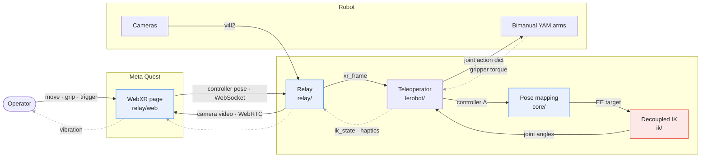

# vr-teleop-kit

Teleoperate a robot manipulator with a Meta Quest headset. A WebXR page
runs in the Quest browser, streams 6-DoF controller poses over a
WebSocket, and a Python teleoperator turns them into joint commands via
differential inverse kinematics. Plugs into
[LeRobot](https://github.com/huggingface/lerobot) as a drop-in
`Teleoperator`.

> **Full write-up:** [VR Teleoperation Stack for Robot Manipulation](https://aurelarnold.xyz/blog/vr-teleoperation-stack/)
> walks through the IK, the safety features, and the camera and haptic
> feedback that close the loop.

Supported end-to-end: a bimanual pair of [I2RT YAM](https://i2rt.com)
arms (linear_4310 gripper), driven through
[i2rt](https://github.com/i2rt-robotics/i2rt). The pose mapping and relay
are robot-agnostic; another arm needs only a new IK layer (see
[Adapting to a different arm](#adapting-to-a-different-arm)).

## Features

| | |
|---|---|
| **Clutch-relative mapping** | Hold grip and the robot follows your hand's relative motion; release to reposition and grab again. |
| **Reach limit** | The target can never run more than a fixed distance/angle ahead of the arm. Joint limits and the workspace boundary feel like a wall (with haptics); reversing bites immediately, like a cursor at the screen edge. |
| **Decoupled IK** | Joints 1-3 track position, the wrist tracks orientation: damped-least-squares steps with manipulability-adaptive damping, graceful near singularities and gimbal lock. |
| **Wrist-pivot calibration** | A 5 s in-VR ritual aligns the controller read-out point with your anatomical wrist pivot, so pure wrist twists don't drag the arm. |
| **Haptics** | Gripper grasp force and IK trouble (joint limits, reach, gimbal proximity) drive controller vibration. |
| **Camera streaming** | Optional WebRTC streams of robot cameras, rendered as world-locked panels in VR. |
| **Live tuning** | Gains, smoothing, velocity caps, and haptic thresholds are tunable from the web page, applied on the next solver tick. |

**Controller buttons:** grip = clutch, a precision modifier (hold to
lower the gains for fine work), and a button that sends the arm home.

## Architecture

Three layers, separated by how robot-specific they are:

```
src/vr_teleop_kit/
├── core/    robot-agnostic: clutch-relative pose mapping + reach limit
├── relay/   robot-agnostic: FastAPI WebSocket relay, WebRTC cameras, WebXR page
├── ik/      YAM-tuned: decoupled IK (MuJoCo model, wrist-anchor geometry)
└── lerobot/ thin adapter: LeRobot Teleoperator classes wiring core + ik together
```

Solid arrows are the command path (operator → arm); dashed arrows are the
feedback path (arm → operator). Node subtitles name the code layer.



Blue nodes are **robot-agnostic** (carry over to any arm); the red node is
**YAM-tuned** (rewrite to port).

For pose and state messages the relay is a pure broadcast hub: any number
of clients (teleop processes, MuJoCo viewers) can subscribe to the same
stream. It also publishes the optional WebRTC camera tracks.

## Install

```bash
git clone https://github.com/Dream-Machines-Robotics/vr-teleop-kit
cd vr-teleop-kit
pip install -e ".[relay,lerobot]"        # or: uv pip install -e ".[relay,lerobot]"

# YAM model files (and, for real hardware, the driver):
git clone https://github.com/i2rt-robotics/i2rt
pip install -e ./i2rt                     # only needed to drive real hardware
```

The IK finds the model files in `./i2rt` automatically. If the clone
lives elsewhere, point at the arm MJCF: `export
YAM_XML=/path/to/i2rt/i2rt/robot_models/arm/yam/yam.xml` (or pass
`model_path` in the teleop config).

| Extra | Pulls in | For |
|---|---|---|
| *(none)* | numpy, mujoco, websockets | pose mapping + IK only |
| `relay` | fastapi, uvicorn, aiortc, av, opencv | the relay server |
| `lerobot` | lerobot | the Teleoperator adapter |

## Run the relay and connect the headset

Both transports serve the same page on port 8443 and differ only in how
the Quest reaches it. WebXR requires a secure context, which is why there
are two paths.

**USB (recommended):** plain HTTP on localhost, forwarded over the cable
(~1 ms RTT, no jitter):

```bash
vr-teleop-relay                       # binds 127.0.0.1:8443
adb reverse tcp:8443 tcp:8443         # forward Quest's localhost over USB
# Quest browser → http://localhost:8443/
```

<details>
<summary>One-time Quest setup for USB</summary>

Enable Developer Mode (Meta Quest mobile app → Devices → your headset →
Developer Mode), plug in the cable, and accept the "Allow USB debugging"
prompt in the headset. Re-run `adb reverse` after re-plugging the cable.
</details>

**LAN:** HTTPS with a self-signed cert (accept the "not secure" warning
once). Works, but Wi-Fi adds occasional >100 ms spikes:

```bash
mkdir -p certs
openssl req -x509 -newkey rsa:4096 -nodes -days 825 \
    -keyout certs/key.pem -out certs/cert.pem \
    -subj "/CN=$(hostname)" \
    -addext "subjectAltName=DNS:$(hostname),DNS:localhost,IP:127.0.0.1,IP:<your-lan-ip>"
vr-teleop-relay --host 0.0.0.0 --ssl-keyfile certs/key.pem --ssl-certfile certs/cert.pem
# Quest browser → https://<your-lan-ip>:8443/
```

`certs/` is gitignored; never commit key material. A public tunnel (e.g.
`cloudflared tunnel --url http://localhost:8443`) works for pose
streaming too, but WebRTC camera media needs a TURN server off-LAN (not
configured here), so full remote operation isn't set up.

**On the page:** **Calibrate wrist** once per operator (squeeze both
grips in VR, then twist your hands for 5 s while keeping each wrist
roughly in place), then **Start Teleop**. Settings apply live.

## Try it without a robot

```bash
vr-teleop-relay                   # terminal 1
python tools/viewer_client.py     # terminal 2: MuJoCo viewer (YAM model)
python examples/pure_sim.py       # terminal 3: IK loop, no hardware
# Quest browser → Start Teleop → squeeze a grip
```

`tools/smoke_test.py` drives the full pipeline with a fake Quest client
and asserts on the resulting actions (no headset needed). Both scripts
use the LeRobot adapter, so they need the `[lerobot]` extra.

## Use as a LeRobot Teleoperator

The adapter emits a bimanual joint action dict
(`{left,right}_joint_{1..6}.pos`, `{left,right}_gripper.pos`; gripper
0 = open, 1 = closed), so it pairs with any follower using that schema.
Nothing is copied into LeRobot's tree; you instantiate it and hand it to
your loop:

```python
import time
from vr_teleop_kit.lerobot import BiQuestTeleoperator, BiQuestTeleoperatorConfig

teleop = BiQuestTeleoperator(BiQuestTeleoperatorConfig(
    id="vr-teleop",
    ws_url="ws://127.0.0.1:8443/ws",
    model_path="/path/to/i2rt/.../arm/yam/yam.xml",  # or YAM_XML / ./i2rt
))

teleop.connect(); follower.connect()
while True:
    follower.send_action(teleop.get_action())
    time.sleep(1 / 200)
```

`examples/teleop_bi_yam.py` is the complete hardware version: two i2rt
YAMs (one CAN channel per arm), rest ramp, gripper-convention conversion,
haptic feedback, and timing. For LeRobot CLIs, import
`vr_teleop_kit.lerobot` so the `@register_subclass` decorators run, then
use `--teleop.type=bi_quest_teleop` (bimanual) or `single_arm_quest_teleop`
(one arm, unprefixed action keys).

<details>
<summary>Human-in-the-loop data collection</summary>

The teleop exposes intervention hooks (`is_engaged`,
`is_handoff_pressed`, `is_pause_pressed`, `is_reverse_pressed`,
`seed_qpos_from_obs`, `publish_state`) that an orchestrator can poll to
hand control between a policy and the operator. We use these for an
HG-DAgger workflow built on top of this stack in our LeRobot fork; that
workflow is not part of this repository.
</details>

<details>
<summary>Enabling grasp-force haptics</summary>

The grasp-force haptic (the controller buzzing as the gripper closes on
an object) reads gripper torque through an optional follower method,
`get_joint_torques()`, returning
`{"{left_,right_}gripper.torque": Nm, "{left_,right_}gripper.pos": 0..1}`.
It's optional: the teleop feature-detects the method via `getattr` and
degrades gracefully without it, disabling only the grasp-force vibration
(IK-trouble haptics still fire).

On YAM this works out of the box: i2rt reports the gripper motor effort
in `get_observations()` (`gripper_eff`), and `examples/teleop_bi_yam.py`
forwards it (plus the gripper position for velocity masking) every tick.
Any follower that implements `get_joint_torques()` with the contract
above gets grasp-force haptics with no other changes.
</details>

## Configuration that is YAM-specific

- **Model path:** the IK builds its MuJoCo model from
  `robot_models/arm/yam/yam.xml` + the linear_4310 gripper MJCF inside an
  [i2rt](https://github.com/i2rt-robotics/i2rt) clone (not vendored).
  Resolution order: `model_path` in the config → `YAM_XML` env var →
  `./i2rt` in the working directory or repo root.
- **`r_calib`:** the fixed rotation from the Quest's `local-floor` world
  frame into the arm base frame. The default assumes the operator faces
  the robot's front; if your mounting differs, re-derive it by mapping
  the operator's forward/left/up onto arm-base axes. (The per-engage yaw
  correction handles the operator turning in the room, so only the axis
  convention matters.)
- **Rest poses** (`rest_qpos_left/right`): where the arms park and what
  the IK's posture bias pulls toward.

## Adapting to a different arm

`core/`, `relay/`, and the web client carry over unchanged. `ik/` does
not; it's written against the YAM's geometry (wrist-anchor site
placement, gripper-mount frame, a 6-DoF arm with a roughly spherical
wrist that splits 3+3 into position/orientation). Porting means
rebuilding `ik/model.py`'s model assembly and site construction for your
model files and checking the decoupling assumption, not just retuning
gains.

> The camera panel ids (`top`, `left_wrist`, `right_wrist`) are fixed in
> the relay and web client; rename or extend them there if your arm has
> a different camera set.

## License

Apache-2.0.
