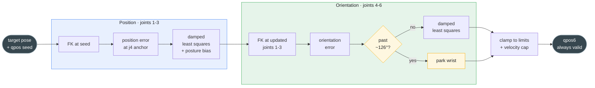

# ik/: decoupled inverse kinematics for the YAM arm

This is the one **robot-specific** layer. Everything else in the kit is
arm-agnostic; `ik/` is written against the YAM's geometry.

## How it works

The YAM is a 6-DoF arm with a *roughly* spherical wrist (joints 4/5/6
axes nearly meet at a point). That geometry lets the 6-DoF problem split
into two independent 3-DoF sub-problems: **joints 1-3 place a
wrist-invariant anchor point** (position) and **joints 4-6 orient the
tool** (orientation). Each sub-problem is one damped-least-squares Newton
step per call, warm-started from the caller's current `qpos`, cheap
enough for a 200 Hz teleop loop, and continuous by construction, so it
needs none of the ±2π branch-unwrapping a closed-form Euler solver would.

`solve()` **never fails**: it always returns a valid joint vector,
degrading gracefully at four boundaries instead of freezing or blowing
up. Along the way it records four scalar "trouble" signals (limit
pressure, reach error, singularity proximity, wrist-gimbal proximity)
that the teleop layer mixes into controller haptics.

## Solve pipeline



The position stage runs first; the orientation stage then FKs at the
*updated* joints 1-3, so the wrist corrects orientation given where the
arm actually landed. Both damped-least-squares steps raise their damping
automatically as the arm nears a singularity or the wrist nears gimbal
lock, keeping the step bounded. The antipode gate (yellow) is the one
hard branch: past ~126&deg; of orientation error the wrist parks rather
than chase an unstable shortest-way direction.

## Why an anchor point, not the tool

The position task targets `j4_anchor`, a site on **link3, upstream of
joint 4, so no wrist joint can move it**. If position tracked the tool
tip instead, twisting the wrist would drag the tip and joints 1-3 would
fight to compensate. Anchoring position to a wrist-invariant point is
what keeps the decoupling clean: a pure wrist twist leaves joints 1-3 at
rest. (The pose mapper uses the same point as its rotation pivot, so the
two layers agree.)

## Boundary handling

| Boundary | What happens |
|---|---|
| Workspace edge | Position Jacobian ill-conditioned → adaptive damping shrinks the step smoothly to zero at the singularity. |
| Wrist gimbal lock (θ5 → ±90°) | Same adaptive damping on the wrist solve; the lost rotation direction just stops being tracked until the operator backs off. |
| Joint limit | Elementwise clamp into the model's limits; residual left for the operator's visual loop. |
| Near-antipodal demand (>~126°) | Shortest-way error direction is unstable near 180°, so the wrist parks and reports saturating limit pressure instead of shaking at the velocity cap. |

A per-joint `max_dq_per_joint` cap is applied last as an operator-safety
velocity bound on any residual fast motion.

## Files

| File | Role |
|---|---|
| `model.py` | Builds the MuJoCo model: merges the YAM arm MJCF with the linear_4310 gripper MJCF (mirroring i2rt's assembly), then adds the two named sites `tool0` (grasp point) and `j4_anchor` (position anchor). Model files are **not vendored**; resolved from `model_path` → `YAM_XML` env → an `./i2rt` clone. |
| `decoupled_ik.py` | `DecoupledIKSolver`, the solver above. Holds the model and cached site ids; `solve()` is the entry point. |

## Running the self-tests

Both modules ship runnable self-tests (round-trip accuracy, gimbal
conditioning, convergence, the antipode gate). They need the YAM model
files reachable (see `model.py`'s resolution order):

```bash
python -m vr_teleop_kit.ik.decoupled_ik
```

## Porting to another arm

Rebuild `model.py`'s model assembly and site construction for your robot,
and check that the 3+3 decoupling assumption holds (a 6-DoF arm with a
roughly spherical wrist). Retuning the damping gains is not enough on its
own. `core/`, `relay/`, and the web client carry over unchanged.
